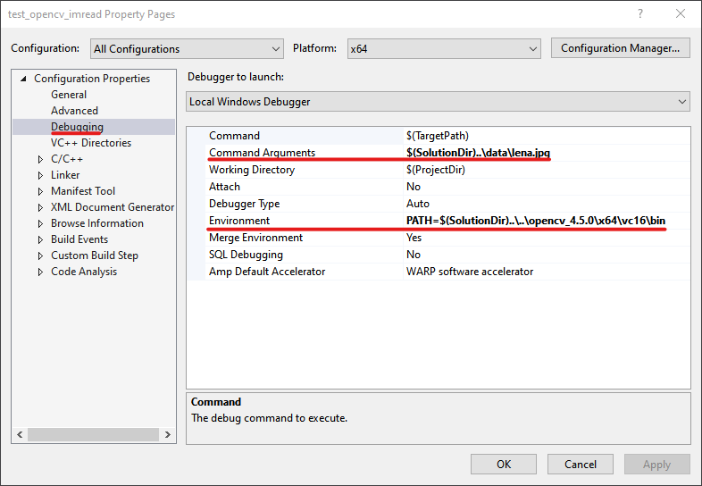

# Test OpenCV functions (C++)
This repository contains small projects to check OpenCV's functions.

## Environment
* Windows 10
* Visual Studio 2019
* OpenCV 4.5.0

The projects are compiled for the x64 platform.

# Project settings
Set the below properties for each project.

1. Set the corresponding `PATH` pointing to the location of binaries of the OpenCV library.
2. Set the corresponding arguments. Set `--help` to display the usage.

Example:

The `opencv_debug_x64.props` and `opencv_release_x64.props` files are the property sheets for Debug and Release
configurations. Open the file on the **Property Manager** and edit **Additional Include Directories**,
**Additional Library Directories**, and **Additional Dependencies** accordingly.

## Projects
| Project name                         | Description                       |
| ------------------------------------ | --------------------------------- |
| test_opencv_version                  | Print the OpenCV version          |
| test_opencv_imread                   | Load an image from a file         |
| test_opencv_videocapture_open_camera | Open a camera for video capturing |
